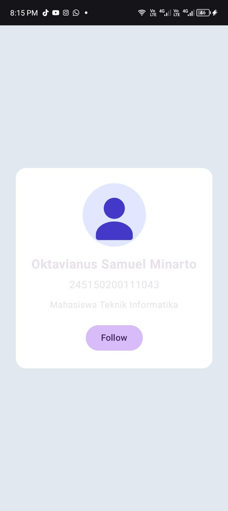
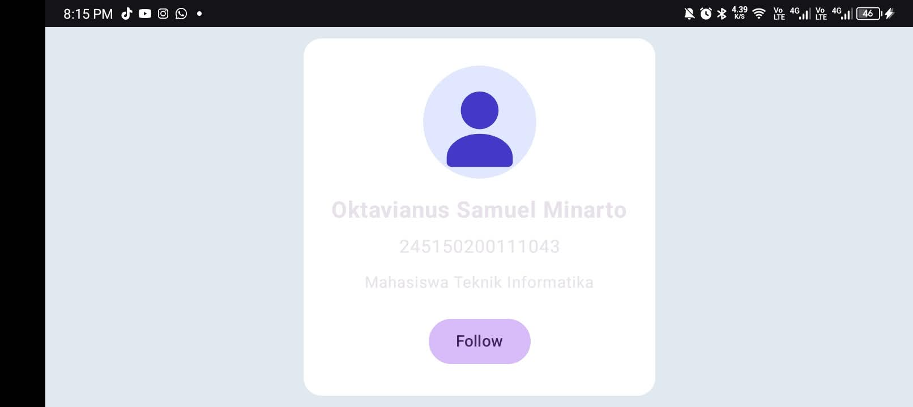

# Tugas Modul 1: Aplikasi Profil Sederha

## Detail Praktikkan
- **Nama**: Oktavianus Samuel Minarto 
- **NIM**: 245150200111043 
- **Program Studi / Kelas**: Teknik Informatika / Kelas A
---

## 1. Deskripsi Aplikasi
Aplikasi ini menampilkan profil mahasiswa sederhana yang dibangun menggunakan komponen-komponen dasar **Jetpack Compose**.

1. **Informasi Profil (Layout Column)**:
   - **Foto Profil**: Gambar vektor dummy (`dummy_avatar.xml`) yang dipotong menjadi bentuk lingkaran (`CircleShape`).
   - **Nama Lengkap**: Ditampilkan dengan teks tebal (*bold*).
   - **NIM**: Ditampilkan di bawah nama.
   - **Deskripsi Singkat**: Menampilkan deskripsi singkat (*"Mahasiswa Teknik Informatika"*).
2. **Tombol Interaktif (Follow / Unfollow)**:
   - Tombol dengan teks awal **"Follow"**.
   - Saat ditekan, teks berubah menjadi **"Unfollow"** (dan sebaliknya).
   - Menggunakan state dinamis `remember { mutableStateOf() }` untuk mengatur perubahan teks secara otomatis (*recomposition*).
3. **Pengaturan Layout & Modifiers**:
   - Semua komponen berada di posisi tengah secara horizontal menggunakan `Alignment.CenterHorizontally`.
   - Menggunakan `Spacer` untuk memberi jarak antar komponen.
   - Memberikan `padding` dan warna latar belakang berbeda pada bagian profil (`Color.White` di dalam container `Column` profil, dengan latar belakang luar layar berwarna abu-abu `#E2E8F0`).
   - Dilengkapi `Modifier.verticalScroll` agar tampilan tetap rapi dan tidak terpotong saat orientasi Landscape.

---

## 2. Penjelasan Singkat Kode (`MainActivity.kt`)

Kode utama diimplementasikan pada file [`MainActivity.kt`](app/src/main/java/com/app/android_jetpack_compose_papb/MainActivity.kt) di dalam fungsi composable `ProfilScreen`:

1. **State `remember { mutableStateOf() }`**:
   ```kotlin
   var isFollowing by remember { mutableStateOf(false) }
   ```
   Variabel `isFollowing` melacak apakah pengguna sedang mengikuti profil atau tidak. Saat tombol ditekan (`onClick = { isFollowing = !isFollowing }`), state berubah sehingga Compose otomatis me-render ulang (*recompose*) teks pada tombol menjadi `"Unfollow"` atau `"Follow"`.

2. **Pengaturan Layout Bertingkat Menggunakan `Column`**:
   - **Outer `Column`**: Berfungsi sebagai container layar penuh (`fillMaxSize()`) dengan latar belakang abu-abu (`Color(0xFFE2E8F0)`), memusatkan konten secara horizontal (`Alignment.CenterHorizontally`) dan vertikal (`Arrangement.Center`).
   - **Profil `Column`**: Container khusus profil dengan latar belakang putih (`Color.White`), sudut membulat (`RoundedCornerShape(16.dp)`), serta `padding(24.dp)`. Ini memenuhi kriteria pemberian padding dan warna latar belakang berbeda pada bagian profil secara sederhana tanpa komponen berlebih.

3. **Komponen Visual Dasar**:
   - **`Image`**: Mengambil gambar dari drawable dengan `painterResource(id = R.drawable.dummy_avatar)` dan dipotong melingkar menggunakan `Modifier.clip(CircleShape)`.
   - **`Spacer(modifier = Modifier.height(...))`**: Memberikan jarak vertikal antar komponen.
   - **`Text`**: Menampilkan nama, NIM, dan deskripsi singkat.
   - **`Button`**: Tombol interaktif dengan teks dinamis `if (isFollowing) "Unfollow" else "Follow"`.


---

## 3. Analisis Keuntungan Jetpack Compose Dibandingkan XML Layout

| Aspek | Jetpack Compose (Deklaratif) | XML Layout Tradisional (Imperatif) |
| :--- | :--- | :--- |
| **Paradigma** | **Deklaratif**: UI mendeskripsikan *apa* yang ditampilkan berdasarkan *state*. Perubahan data otomatis memicu pembaruan UI (*recomposition*). | **Imperatif**: UI didefinisikan statis di XML, lalu properti view diubah manual via kode (`setText`, `setVisibility`). |
| **Bahasa Pemrograman** | **100% Kotlin**: Tidak ada pemisahan bahasa, mendukung type-safety dan logika pemrograman langsung di dalam UI. | **Campuran (XML + Kotlin/Java)**: Sering terjadi kesalahan binding ID atau tipe data karena pemisahan file. |
| **Boilerplate Code** | **Sangat Sedikit**: Tidak memerlukan `findViewById()`, ViewBinding, maupun file XML layout dan styling yang terpisah-pisah. | **Banyak File & Boilerplate**: Membutuhkan banyak file XML untuk layout, selector, dan style terpisah. |
| **Manajemen State** | **Reaktif & Bersih**: State berfungsi sebagai *single source of truth*, menghindari bug desinkronisasi tampilan. | **Manual**: Pengembang harus mengontrol sinkronisasi antara logika data dan tampilan view secara manual. |
| **Modularitas** | **Fungsi Composable**: Sangat mudah membuat komponen modular hanya dengan menulis fungsi Kotlin biasa bertanda `@Composable`. | **Custom View Rumit**: Membuat komponen kustom memerlukan pembuatan class turunan `View`/`ViewGroup` dan atribut XML khusus. |
| **Preview** | **Preview Cepat di IDE**: Mendukung `@Preview` instan untuk berbagai orientasi dan konfigurasi tanpa perlu menjalankan emulator. | **Preview Terbatas**: Sering kali pratinjau XML di IDE tidak akurat menampilkan hasil sebenarnya. |

---

## 4. Screenshot Tampilan Aplikasi

|             Tampilan Portrait             |             Tampilan Landscape              |
|:-----------------------------------------:|:-------------------------------------------:|
|  |  |
